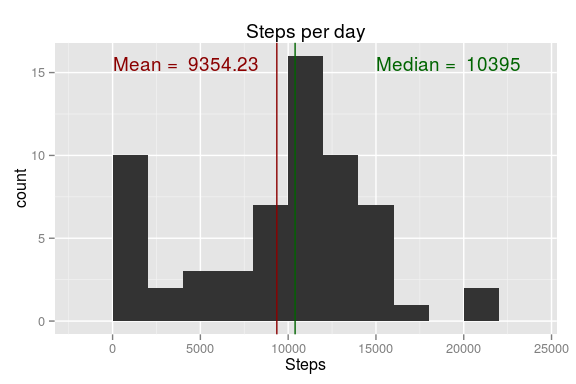
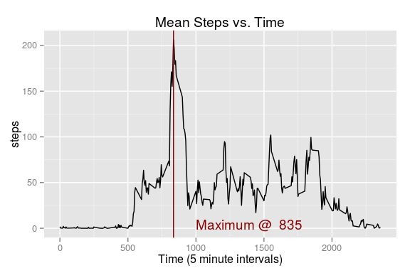
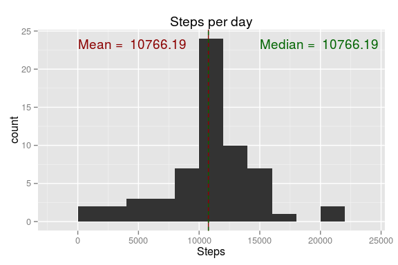
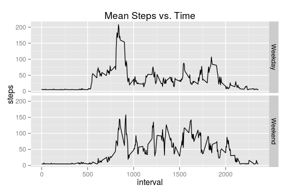

# Reproducible Research: Peer Assessment 1
## Loading and preprocessing the data


```r
#Load the data to a data frame

activity.df <- read.csv("activity.csv")

#Convert the date field to a date data type
activity.df$date <- as.Date(activity.df$date)
```
## What is mean total number of steps taken per day?


```r
# Calculate the total number of steps taken per day
steps.per.day <- aggregate( 
  x = activity.df$steps,
  by = list(activity.df$date),
  FUN = sum,
  na.rm=T)
names(steps.per.day) <- c("Date", "Steps")

#Mean and median steps per day
mean.spd <- mean(steps.per.day$Steps, na.rm=TRUE)
median.spd <- median(steps.per.day$Steps, na.rm=TRUE)

#Generate the plot with annotations for median and mean
library(ggplot2)
hist <- ggplot(steps.per.day, aes(x=Steps)) +
  ggtitle("Steps per day") +
  xlab("Steps") +
  geom_histogram(binwidth=2000) +
  annotate("text", label = paste("Mean = ", format(mean.spd)), 
               x = 0, hjust = 0, y = Inf, vjust = 2, color = "darkred") +
  annotate("text", label = paste("Median = ", format(median.spd)), 
               x = 15000, hjust = 0, y = Inf, vjust = 2, color = "darkgreen") +
  geom_vline(xintercept = mean.spd, color = "darkred") +
  geom_vline(xintercept = median.spd, color = "darkgreen")
hist
```

 

The mean total number of steps per day:

```r
print(mean.spd)
```

```
## [1] 9354.23
```

The median total number of steps per day:

```r
print(median.spd)
```

```
## [1] 10395
```

## What is the average daily activity pattern?


```r
#Average number of steps taken, averaged over all days
mean.steps  <- aggregate(
  x = activity.df$steps , 
  by = list(activity.df$interval), 
  FUN = mean,
  na.rm=TRUE)
names(mean.steps) <- c("interval","steps")

#Find the interval with the maximum of mean.steps$steps
max.steps <- mean.steps[which.max(mean.steps$steps),c("interval")]

#Generate the time series plot
steps.ts <- ggplot(mean.steps,aes(interval,steps)) +
  ggtitle("Mean Steps vs. Time") +
  geom_line() +
  xlab("Time (5 minute intervals)")  +
  annotate("text", label = paste("Maximum @ ", format(max.steps)), 
               x = 1000, hjust = 0, y = 20, vjust = 2, color = "darkred") +
  geom_vline(xintercept = max.steps <- mean.steps[which.max(mean.steps$steps),c("interval")],
             color="darkred")
steps.ts 
```

 

Which 5-minute interval, on average across all the days in the dataset, contains the maximum number of steps?

```r
max.steps
```

```
## [1] 835
```
## Imputing missing values

The total number of missing values in the dataset (i.e. the total number of rows with NAs)

```r
nrow(activity.df[is.na(activity.df$steps),])
```

```
## [1] 2304
```

To impute the missing data, we will use the impute() function from the Hmisc library. This will use cubic spline imputation of the missing values, which is a good strategy if the time series is a smooth function.

```r
library(Hmisc)
```

```
## Loading required package: grid
## Loading required package: lattice
## Loading required package: survival
## Loading required package: splines
## Loading required package: Formula
## 
## Attaching package: 'Hmisc'
## 
## The following objects are masked from 'package:base':
## 
##     format.pval, round.POSIXt, trunc.POSIXt, units
```

```r
activity.imputed.df <- activity.df
activity.imputed.df$steps <- with(activity.df, impute(steps, mean))
```

Repeat the previous plot using the imputed data.

```r
# Calculate the total number of steps taken per day
steps.per.day <- aggregate( 
  x = activity.imputed.df$steps,
  by = list(activity.imputed.df$date),
  FUN = sum,
  na.rm=T)
names(steps.per.day) <- c("Date", "Steps")
mean.spd <- mean(steps.per.day$Steps, na.rm=TRUE)
median.spd <- median(steps.per.day$Steps, na.rm=TRUE)
library(ggplot2)
hist <- ggplot(steps.per.day, aes(x=Steps)) +
  ggtitle("Steps per day") +
  xlab("Steps") +
  geom_histogram(binwidth=2000) +
  annotate("text", label = paste("Mean = ", format(mean.spd)), 
               x = 0, hjust = 0, y = Inf, vjust = 2, color = "darkred") +
  annotate("text", label = paste("Median = ", format(median.spd)), 
               x = 15000, hjust = 0, y = Inf, vjust = 2, color = "darkgreen") +
  geom_vline(xintercept = mean.spd, color = "darkred") +
  geom_vline(xintercept = median.spd, color = "darkgreen", linetype=2)
hist
```

 

The mean total number of steps per day:

```r
print(mean.spd)
```

```
## [1] 10766.19
```

The median total number of steps per day:

```r
print(median.spd)
```

```
## [1] 10766.19
```

## Are there differences in activity patterns between weekdays and weekends?


```r
#Create a factor in the data frame to indicate Weekend or Weekday
activity.imputed.df$weekday <- as.factor(ifelse(weekdays(activity.imputed.df$date) %in% c("Saturday","Sunday"), "Weekend", "Weekday")) 

#Compute the average number of steps per weekday and weekend in a data frame
steps.per.weekday  <- aggregate(
                      x = activity.imputed.df$steps , 
                      by = list(activity.imputed.df$interval,activity.imputed.df$weekday), 
                      FUN = mean,
                      na.rm=TRUE)
names(steps.per.weekday) <- c("interval","weekday","steps")

#Plot the two plots using a facet_grid
avg.steps <- ggplot(steps.per.weekday,aes(interval,steps)) +
                 ggtitle("Mean Steps vs. Time") +
                 facet_grid(weekday ~ .) +
                 geom_line()
avg.steps 
```

 
